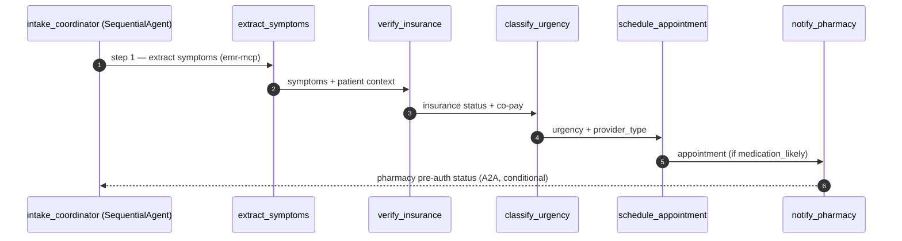

<!-- AgentForge Design Contract — GOLDEN REFERENCE -->
<!-- App 1: Patient Intake Triage (Healthcare, Sequential pattern) -->
<!-- Authored by AnchorOps.ai LLC as the M2b validation reference. -->
<!-- TechTrapture compares the Design Agent's actual design-contract.md against this file. -->
<!-- This is the .md (15 sections incl. §3 STL). The .json is produced only by validate_contract on pass. -->

# Design Contract — Patient Intake Triage Agent

**Solution ID:** `patient-intake-triage`
**Archetype:** agentic · **Primary Pattern:** Sequential
**Industry:** Healthcare · **Data Classification:** PHI (HIPAA)
**Contract Version:** 1.0.0 · **Generated by:** Design Agent (golden reference, AnchorOps-authored)
**Source spec:** spec.md (Patient Intake Triage) · **Source plan:** plan.md

---

## §1. Solution Overview

Automate patient intake triage for a multi-location outpatient clinic network. When a patient
contacts the clinic by phone or web portal, the agent extracts symptoms from unstructured text,
verifies insurance coverage, classifies clinical urgency, schedules an appropriate appointment,
and — when medication is likely needed — sends a pre-authorization request to the pharmacy
partner's external system. Target: reduce intake from ~15 minutes (manual) to under 2 minutes.

| Attribute | Value |
|---|---|
| Use case | Patient intake triage (phone + web portal) |
| Archetype | agentic |
| Primary pattern | Sequential (5-step linear chain) |
| Agents | 6 (1 SequentialAgent coordinator + 5 LlmAgents) |
| External integrations | 3 MCP servers + 1 A2A agent + 1 FunctionTool |
| Peak volume | 200 intakes/hour |
| End-to-end latency target | P95 < 30 seconds |
| Availability | 99.9% (clinic hours 7am–9pm ET, Mon–Sat) |
| Data classification | PHI — HIPAA-regulated (CMEK, VPC-SC, Model Armor) |
| DR strategy | Warm Standby (RTO 15 min, RPO 0) |

---

## §2. Pattern Composition

**Selected pattern:** `Sequential` (`SequentialAgent` root) — **confidence 0.95**
**Detected by:** MS1 `pattern-composition` from spec §2 ordering words "First… Then… Then… Then… Finally."

**Rationale:** The workflow is strictly ordered — urgency cannot be classified before symptoms are
extracted, an appointment cannot be scheduled before urgency is known, and pharmacy pre-authorization
cannot occur before a visit is scheduled. Each step consumes the prior step's output, which is the
defining signal for a Sequential composition rather than Parallel or Loop.

**Adjacency validation:** PASS — single-level `SequentialAgent` with five `LlmAgent` leaf children.
No nested workflow agents; no `LoopAgent` inside `LoopAgent`; no `ParallelAgent` nesting violations.



---

## §3. Agent Topology — Structured Topology Language (STL)

<!-- topology:begin -->

### Agents

| Agent | Type | Role | Parent | Model | Tools |
|---|---|---|---|---|---|
| intake_coordinator | SequentialAgent | Orchestrates the 5-step intake chain in order | — (root) | gemini-2.0-flash | — |
| extract_symptoms | LlmAgent | Extract symptoms + clinical details from unstructured input | intake_coordinator | gemini-2.0-flash | emr-mcp |
| verify_insurance | LlmAgent | Verify eligibility + co-pay via payer API | intake_coordinator | gemini-2.0-flash | insurance-api-mcp |
| classify_urgency | LlmAgent | Classify routine/urgent/emergent via triage rules | intake_coordinator | gemini-2.0-flash | triage_classifier_fn |
| schedule_appointment | LlmAgent | Book appropriate provider/appointment by urgency | intake_coordinator | gemini-2.0-flash | scheduling-mcp |
| notify_pharmacy | LlmAgent | Send pre-authorization to pharmacy partner (conditional) | intake_coordinator | gemini-2.0-flash | pharmacy-agent |

### Tool Bindings

| Agent | Tool | Protocol | Purpose |
|---|---|---|---|
| extract_symptoms | emr-mcp | MCP | Patient lookup, symptom recording, clinical history retrieval |
| verify_insurance | insurance-api-mcp | MCP | Eligibility check, co-pay calculation, coverage verification |
| classify_urgency | triage_classifier_fn | FunctionTool | Apply 5 IF/THEN triage rules (spec §7) |
| schedule_appointment | scheduling-mcp | MCP | Appointment search, booking, confirmation |
| notify_pharmacy | pharmacy-agent | A2A | Pre-authorization request to RxPartner Health |

### A2A Delegations

| Agent | Delegates To | Capabilities | Source |
|---|---|---|---|
| notify_pharmacy | pharmacy-agent | pre-authorization, fill-time-estimate | Agent Registry (RxPartner Health) |

### Data Flows

| From | To | Data | Protocol |
|---|---|---|---|
| intake_coordinator | extract_symptoms | step 1 trigger (patient intake payload) | in-process |
| extract_symptoms | emr-mcp | patient_id, free-text symptoms | MCP |
| emr-mcp | extract_symptoms | structured symptoms, clinical history | MCP |
| extract_symptoms | verify_insurance | symptoms + patient context | in-process |
| verify_insurance | insurance-api-mcp | member_id, plan | MCP |
| insurance-api-mcp | verify_insurance | eligibility, co-pay, status | MCP |
| verify_insurance | classify_urgency | insurance status + co-pay | in-process |
| classify_urgency | triage_classifier_fn | symptom_severity, duration, insurance_status | FunctionTool |
| classify_urgency | schedule_appointment | urgency + provider_type | in-process |
| schedule_appointment | scheduling-mcp | provider_type, urgency, availability window | MCP |
| schedule_appointment | notify_pharmacy | appointment + medication_likely flag | in-process |
| notify_pharmacy | pharmacy-agent | patient_id, prescribing_provider, ICD-10 | A2A |

### Sequence Summary

1. intake_coordinator receives the patient intake payload (phone transcript or web form).
2. extract_symptoms calls emr-mcp to record symptoms and retrieve clinical history.
3. verify_insurance calls insurance-api-mcp for eligibility and co-pay.
4. classify_urgency invokes triage_classifier_fn to assign urgency + provider_type.
5. schedule_appointment calls scheduling-mcp to book the appropriate appointment.
6. If medication_likely is true, notify_pharmacy delegates pre-authorization to pharmacy-agent (A2A).
7. pharmacy-agent returns authorization status and estimated fill time.
8. intake_coordinator aggregates results into the intake outcome.
9. The intake outcome is returned to the calling staff coordinator.

<!-- topology:end -->

---

## §4. Tool Bindings (Resolved)

| Tool | Type | Endpoint | Auth | Discovered via |
|---|---|---|---|---|
| emr-mcp | MCP Server | `mcp://emr-mcp.internal/v1` | OAuth 2.1 (client credentials) | MS2 data-platform-selection (Tool Catalog) |
| insurance-api-mcp | MCP Server | `mcp://insurance-api-mcp.internal/v1` | OAuth 2.1 (client credentials) | MS2 data-platform-selection (Tool Catalog) |
| scheduling-mcp | MCP Server | `mcp://scheduling-mcp.internal/v1` | OAuth 2.1 (client credentials) | MS2 data-platform-selection (Tool Catalog) |
| triage_classifier_fn | FunctionTool | in-process (see §5) | n/a | MS4 skill-tool-discovery |
| pharmacy-agent | A2A Agent | `https://rxpartner.health/.well-known/agent.json` | mTLS + OAuth 2.1 token exchange | MS3 agent-boundary (Agent Registry) |

---

## §5. FunctionTool Specification — `triage_classifier_fn`

Deterministic classifier implementing the five business rules from spec §7. First-draft generated
code; clinical staff must validate the IF/THEN logic before production (see §9).

```python
def triage_classifier_fn(
    symptom_severity: str,
    duration_days: int,
    insurance_status: str,
    medication_likely: bool,
) -> dict:
    """Classify clinical urgency and provider type from triage signals (spec §7 rules)."""
    urgency = "routine"
    provider_type = "PCP"
    flag = None
    notify_pharmacy = False

    # Rule 1 — emergent
    if symptom_severity in ("chest_pain", "breathing_difficulty"):
        urgency, provider_type = "emergent", "ER"
    # Rule 2 — urgent (high fever, sustained)
    elif symptom_severity == "high_fever" and duration_days >= 3:
        urgency, provider_type = "urgent", "PCP_same_day"
    # Rule 3 — routine specialist follow-up
    elif symptom_severity == "chronic_condition_followup":
        urgency, provider_type = "routine", "specialist"

    # Rule 4 — uninsured pathway (does not block triage; keeps current urgency)
    if insurance_status in ("inactive", "expired"):
        flag = "uninsured_pathway"

    # Rule 5 — pharmacy pre-authorization
    if urgency in ("emergent", "urgent") and medication_likely:
        notify_pharmacy = True

    return {
        "urgency": urgency,
        "provider_type": provider_type,
        "flag": flag,
        "notify_pharmacy": notify_pharmacy,
    }
```

---

## §6. Infrastructure Modules

| Module | Repo | Purpose |
|---|---|---|
| adk-cloudrun | `github.com/anchorops/tf-adk-cloudrun` | ADK agent runtime on Cloud Run (GA), private VPC |
| apigee-gateway | `github.com/anchorops/tf-apigee-gateway` | Apigee Runtime Gateway, OAuth 2.1, mTLS, proxy routes |
| agent-identity | `github.com/anchorops/tf-agent-identity` | Per-agent Workload Identity SAs + least-privilege IAM |
| security-baseline-hipaa | `github.com/anchorops/tf-security-hipaa` | CMEK, VPC-SC perimeter, Model Armor, Splunk log forwarding |

---

## §7. Security Configuration

| Agent | Model Armor | Service Account | Data Scope (HIPAA minimum necessary) |
|---|---|---|---|
| intake_coordinator | Standard (prompt+response) | `sa-intake-coordinator` | orchestration metadata only |
| extract_symptoms | Standard (PHI screening) | `sa-extract-symptoms` | patient demographics + symptoms |
| verify_insurance | Standard | `sa-verify-insurance` | member_id, plan, eligibility |
| classify_urgency | Standard | `sa-classify-urgency` | symptom severity + duration (no identifiers) |
| schedule_appointment | Standard | `sa-schedule-appointment` | provider, slot, urgency |
| notify_pharmacy | Standard (egress screening) | `sa-notify-pharmacy` | patient_id, ICD-10, prescriber |

- **Encryption:** CMEK for all data at rest; TLS 1.3 for all data in transit.
- **Network:** Private VPC, no public endpoints; VPC-SC perimeter around all PHI services.
- **Model Armor:** prompt + response screening on every agent for PHI leakage.

---

## §8. Agent Identity Configuration (Least-Privilege)

| Agent | Capabilities (allowed) | Denied | Delegation |
|---|---|---|---|
| intake_coordinator | invoke:child-agents | tool:emr-mcp, tool:insurance-api-mcp, tool:scheduling-mcp, a2a:pharmacy-agent | — |
| extract_symptoms | tool:emr-mcp:read, tool:emr-mcp:write-symptoms | tool:insurance-api-mcp, tool:scheduling-mcp, a2a:pharmacy-agent | — |
| verify_insurance | tool:insurance-api-mcp:read | tool:emr-mcp, tool:scheduling-mcp, a2a:pharmacy-agent | — |
| classify_urgency | tool:triage_classifier_fn:invoke | tool:emr-mcp, tool:insurance-api-mcp, tool:scheduling-mcp, a2a:pharmacy-agent | — |
| schedule_appointment | tool:scheduling-mcp:read, tool:scheduling-mcp:book | tool:emr-mcp, tool:insurance-api-mcp, a2a:pharmacy-agent | — |
| notify_pharmacy | a2a:pharmacy-agent:pre-authorize | tool:emr-mcp, tool:insurance-api-mcp, tool:scheduling-mcp | pharmacy-agent (RxPartner Health) |

Every agent's `denied` list is non-empty (enforces check 9 least-privilege). Capabilities match the
§3 STL Tool Bindings exactly (enforces check 8 identity consistency).

---

## §9. Business Rules

| # | Rule (IF / THEN) |
|---|---|
| 1 | IF symptom_severity = "chest_pain" OR "breathing_difficulty" → urgency = "emergent" AND provider_type = "ER" |
| 2 | IF symptom_severity = "high_fever" AND duration_days >= 3 → urgency = "urgent" AND provider_type = "PCP_same_day" |
| 3 | IF symptom_severity = "chronic_condition_followup" → urgency = "routine" AND provider_type = "specialist" |
| 4 | IF insurance_status = "inactive" OR "expired" → urgency = KEEP_CURRENT AND flag = "uninsured_pathway" |
| 5 | IF urgency IN ("emergent","urgent") AND medication_likely = true → notify_pharmacy = true |

---

## §10. Observability

| Concern | Tool | Configuration |
|---|---|---|
| APM | Dynatrace | intake volume, latency P50/P95/P99, error rate per agent |
| SIEM | Splunk | HIPAA-compliant log forwarding, PHI field masking |
| Tracing | OpenTelemetry → Cloud Trace | per-agent spans across the 5-step chain |
| Dashboards | Dynatrace | intake throughput, urgency distribution, pharmacy pre-auth success |
| Alerting | Dynatrace | P95 latency > 30s; error rate > 1%; Model Armor block spike |

---

## §11. CI/CD Pipeline

- **Build/Deploy:** Cloud Build + Cloud Deploy (default).
- **Promotion ladder:** Non-Prod → Pre-Prod (canary 10%) → Production.
- **EvalOps:** 3-phase — (1) pre-commit golden-dataset gate, (2) AutoSxS baseline comparison,
  (3) HITL review by 2 clinical staff reviewers.
- **Gates:** PRS scan → EvalOps → cosign + Binary Authorization (3-gate attestation chain) before
  admission. The platform generates the pipeline; it never deploys.

---

## §12. Gateway Routes

| # | Route | Type | Target | Auth |
|---|---|---|---|---|
| 1 | `POST /api/v1/intake` | External | intake_coordinator (Cloud Run) | OAuth 2.1 (staff) |
| 2 | `mcp://emr-mcp.internal/v1` | MCP proxy | emr-mcp | OAuth 2.1 + mTLS |
| 3 | `mcp://insurance-api-mcp.internal/v1` | MCP proxy | insurance-api-mcp | OAuth 2.1 + mTLS |
| 4 | `mcp://scheduling-mcp.internal/v1` | MCP proxy | scheduling-mcp | OAuth 2.1 + mTLS |
| 5 | `a2a://pharmacy-agent` | A2A proxy | pharmacy-agent (RxPartner) | mTLS + token exchange |

Every MCP tool in §3 STL Tool Bindings has a corresponding proxy route (enforces check 12).

---

## §13. NFR Targets

| # | Requirement | Target |
|---|---|---|
| 1 | End-to-end latency (P95) | < 30 seconds |
| 2 | Emergent-path latency | < 10 seconds |
| 3 | Throughput | 200 intakes/hour sustained |
| 4 | Concurrent users | 25 intake coordinators |
| 5 | Availability | 99.9% (clinic hours 7am–9pm ET, Mon–Sat) |
| 6 | RTO | 15 minutes |
| 7 | RPO | 0 (synchronous replication) |
| 8 | DR strategy | Warm Standby (DR region us-central1) |
| 9 | Data classification | PHI (HIPAA-regulated) |
| 10 | Encryption | CMEK at rest, TLS 1.3 in transit |
| 11 | Network isolation | Private VPC, VPC-SC perimeter, no public endpoints |
| 12 | PHI screening | Model Armor on every agent (prompt + response) |

---

## §14. A2A Agent Card Reference

| Field | Value |
|---|---|
| Agent | pharmacy-agent |
| Provider | RxPartner Health (external partner) |
| Version | v1.2 |
| Agent Card URL | `https://rxpartner.health/.well-known/agent.json` |
| Capabilities | pre-authorization, fill-time-estimate |
| Input | patient_id, prescribing_provider, ICD-10 code |
| Output | authorization_status, estimated_fill_time |
| Auth | mTLS + OAuth 2.1 token exchange |
| SLA | < 5s pre-auth response; 99.5% availability |
| Discovered via | MS3 agent-boundary → Agent Registry |

---

## §15. Golden Dataset Seed (10 Entries)

10 seeded entries covering the 5 acceptance criteria; TechTrapture expands to 50 (10 + 40 manual).

| # | Input | Expected Output | Rules Tested |
|---|---|---|---|
| 1 | Severe chest pain for 2 hours, insured, BlueCross PPO | urgency=emergent, provider=ER, notify_pharmacy=false | Rule 1 |
| 2 | High fever (103°F) for 4 days, insured, Aetna HMO | urgency=urgent, provider=PCP_same_day, notify_pharmacy=true | Rule 2 + 5 |
| 3 | Diabetes follow-up, medication refill needed, insured, UHC | urgency=routine, provider=specialist, notify_pharmacy=true | Rule 3 + 5 |
| 4 | Sprained ankle, insurance expired 2 months ago | urgency=routine, flag=uninsured_pathway | Rule 4 |
| 5 | Breathing difficulty + wheezing, insured, Cigna, on albuterol | urgency=emergent, provider=ER, notify_pharmacy=true | Rule 1 + 5 |
| 6 | Routine physical exam, no complaints, insured | urgency=routine, provider=PCP | Default |
| 7 | Child age 3, rash + fever 2 days, insured | urgency=urgent, provider=PCP_same_day | Rule 2 variant |
| 8 | Back pain chronic, 6 months, specialist referral, uninsured | urgency=routine, provider=specialist, flag=uninsured_pathway | Rule 3 + 4 |
| 9 | Chest pain + expired insurance + medication likely | urgency=emergent, provider=ER, flag=uninsured_pathway, notify_pharmacy=true | Rule 1 + 4 + 5 |
| 10 | Headache 1 day, insured, Anthem, no medication | urgency=routine, provider=PCP, notify_pharmacy=false | Default |

---

*CONFIDENTIAL — AnchorOps.ai LLC — All Rights Reserved. Disclosed under MNDA.*
*Golden reference design-contract.md for AgentForge M2b validation (App 1, Sequential / Healthcare).*
